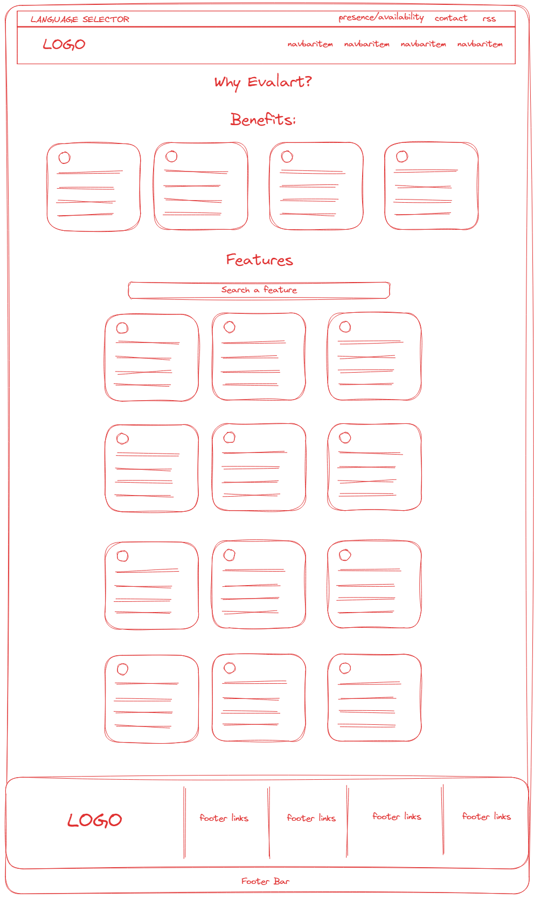

# Evalart Home Assigment

- [Evalart Home Assigment](#evalart-home-assigment)
	- [Production](#production)
	- [Technologies](#technologies)
	- [Usage (Instructions for setting up and running the mock-up.)](#usage-instructions-for-setting-up-and-running-the-mock-up)
		- [Install and run development server and JSON-Server MOCK](#install-and-run-development-server-and-json-server-mock)
	- [Design IDEAS (An overview of your design choices and any assumptions made.)](#design-ideas-an-overview-of-your-design-choices-and-any-assumptions-made)
	- [Just to know.](#just-to-know)
	- [Choices / Assumptions](#choices--assumptions)
		- [Folder Structure](#folder-structure)
	- [Mockup](#mockup)
	- [Future (Reflections on what additional features or improvements you would have made if you had more time.)](#future-reflections-on-what-additional-features-or-improvements-you-would-have-made-if-you-had-more-time)
	- [Improvements for this project](#improvements-for-this-project)

## Production

- Runs on vercel hosting at [Features - Evalart (evalart-home-assigment.vercel.app)](https://evalart-home-assigment.vercel.app/)
- Uses [My JSON Server](https://my-json-server.typicode.com/) as the JSON-Server mockup

## Technologies

- React, TypeScript + SWC with Vite
- Tailwind CSS

Mobile first based, and let me develop faster without creating new CSS files for each component 😀

## Usage (Instructions for setting up and running the mock-up.)

The project already has env files to handle the mock API in development or production.

If you would like yo change the API_URL used, you can do this changing it inside `.env.development` or `.env.production` but following the `db.json` structure.

### Install and run development server and JSON-Server MOCK

```bash
# I use pnpm but you could use other 😀

# install dependencies
pnpm install

# Run vite development server
pnpm run dev;

# Install JSON-server
pnpm install -g json-server
# Do pnpm setup if you dont have it already.

# Run mock JSON-SERVER through cli but using the package json command in another terminal
pnpm run mock:dev
```

## Design IDEAS (An overview of your design choices and any assumptions made.)

## Just to know.

- While reading the features at the page, I noticed that “Detailed Report” feature is duplicated. But with different ‘descriptions’ so i suppose theres another feature but theres not a proper name for it. The second one have and URL which end on ‘spanish’ lang “/reportes-detallados”

---

## Choices / Assumptions

### Folder Structure

```bash
- src
 |- components # All the reusable components such as Card, Link, Section ...
 |- [name] # each folder is a collection of (in this case) sections of the feature page.
```

---

I wanted to preserve the structure of the page, but focus on improving the space, readability, and user experience.

Placing texts with better contrast and maintaining a suitable size for reading.

Adding the possibility to search for "Features" through an input, taking into account possible matches in title, description, and some keywords added from the mock backend.

Add the logo to the footer and align the links to the right.



After thinking for a bit, I considered that since the benefits are static, they could simply be content in text for the user. Therefore, it would be better not to treat them as 'CARDS', but perhaps just add a background.


I decided to add a button to view related content for each of the "features".


## Mockup

My added functionality is the ability to filter existing features using the title, description, and some keywords. For this, I used the following structure:

Based on how APIs created using the [JSON:API](https://jsonapi.org/format/#document-resource-object-relationships) specification work, I decide to add a "relationship" property to each feature that comes from the Mock to be used as a "Read more" link.

Icon = In this case an string for use with @iconify/react but it can be an static asset.

Title = Feature title

Description = Feature description

Keywords = Word to use in the search filter

Relationship = An URL which have relationship with the feature.

```bash
{
	"icon": "",
	"title" : "",
	"description": "",
	"keywords": [],
	"relationship": "",
}
```

## Future (Reflections on what additional features or improvements you would have made if you had more time.)

- Add the ability for users to "request" features themselves.
- Instead of displaying "Cards" for each feature, create a section like this:


Users can select all the features they know about with their description and even watch a small demo of how it works.

• Improve the benefits section to make it more eye-catching.

## Improvements for this project

Add constants with the links used so that they can be reused in new pages/components.